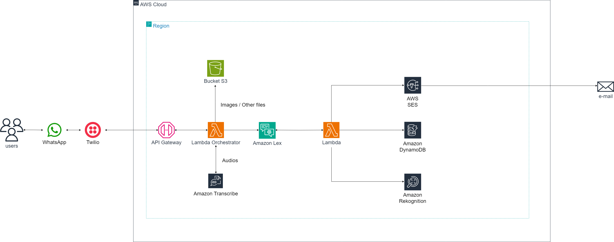

# aloPolicia-chatbot
AlôPolícia - Um ChatBot para auxiliar as Autoridades na criação de Boletins de Ocorrência e Denúncias
# AlôPolícia - Um ChatBot para auxiliar as Autoridades na criação de Boletins de Ocorrência e Denúncias

## Índice 🗂️

1. [Sobre o projeto](#secao1)
2. [Recursos do ChatBot](#secao2)
3. [Arquitetura e estrutura de pastas do Projeto](#secao3)
4. [Requisitos para Utilização](#secao4)
5. [Como Utilizar](#secao5)
6. [Tecnologias utilizadas no Desenvolvimento](#secao6)
7. [Como o Projeto foi Desenvolvido](#secao7)

<div id='secao1'/>

## 1. Sobre o projeto 📄

O ChatBot AlôPolícia é um recurso para auxiliar as autoridades a colher informações de maneira rápida e prática para o desenvolvimento de Boletins de Ocorrência e Denúncias. Trata-se de um contato que pode ser salvo no WhatsApp e que responde mensagens de forma automática.

<div id='secao2'/>

## 2. Recursos do ChatBot

- Gera Boletins de Ocorrência e Denúncias;
- Função para chamar a Polícia via chat;
- Exibe contatos das Autoridades;
- Aceita comandos de voz;
- Recebe e processa imagens;
- Armazena dados;
- Envia e-mails para o usuário automaticamente.

<div id='secao3'/>

## 3. Arquitetura e estrutura de pastas do projeto 🌐

**3.1 Arquitetura do projeto**



**3.2 Estrutura de pastas do projeto**

```

│ 
│   .gitignore
│   README.md
│
├───bot
│   │   AloPoliciaChatbot-DRAFT-5PAIGCPVOC-LexJson.zip
│   │   Manifest.json
│   │
│   └───AloPoliciaChatbot
│       │   Bot.json
│       │
│       └───BotLocales
│           └───pt_BR
│               │   BotLocale.json
│               │
│               ├───Intents
│               │   ├───...
│               └───SlotTypes
│                   ├───...
├───docs
│       arquitetura.png
│       banner.png
│       qr code chatbot.png
│
├───lex-backend
│   │   .gitignore
│   │   package.json
│   │   requirements.txt
│   │   serverless.yml
│   │
│   └───src
│       │   .env.example
│       │   env_constants.py
│       │   lambda_function.py
│       │
│       ├───aws
│       │   ├───dynamoDB
│       │   │       send_domestic_violence_to_dynamo.py
│       │   │       send_fraud_to_dynamo.py
│       │   │       send_missing_people_to_dynamo.py
│       │   │       send_other_bo_to_dynamo.py
│       │   │       send_report_to_dynamo.py
│       │   │       send_theft_to_dynamo.py
│       │   │
│       │   ├───rekognition
│       │   │       compare_faces.py
│       │   │
│       │   └───ses
│       │           send_confirmation_mail.py
│       │           send_match_mail.py
│       │           send_notification_mail.py
│       │
│       ├───intents
│       │   │   bo_fraude.py
│       │   │   bo_outros.py
│       │   │   bo_pessoas_desaparecidas.py
│       │   │   bo_roubo_furto.py
│       │   │   bo_violencia_domestica.py
│       │   │   chamar_policia.py
│       │   │   denuncia_desmanche.py
│       │   │   denuncia_foragido.py
│       │   │   denuncia_outros.py
│       │   │   denuncia_vandalismo.py
│       │   │   pessoas_desaparecidas.py
│       │   │   violencia_domestica.py
│       │   │
│       │   └───dialog_utils
│       │           get_cep_response.py
│       │           get_cpf_response.py
│       │           get_phone_response.py
│       │           lex_responses.py
│       │
│       └───utils
│               get_slot_value.py
│               validate_cep.py
│               validate_cpf.py
│               validate_phone.py
│
└───orchestrator
    │   package.json
    │   requirements.txt
    │   serverless.yml
    │
    └───src
        │   .env.example
        │   env_variables.py
        │   handler.py
        │
        ├───aws
        │   ├───lex
        │   │       get_session.py
        │   │       send_text_to_lex.py
        │   │
        │   ├───s3
        │   │       put_media.py
        │   │
        │   └───transcribe
        │           audio_to_text.py
        │
        └───twilio
            │   TwiloClient.py
            │
            └───functions
                    get_twilio_body.py
                    send_message.py

```

<div id='secao4'/>

## 4. Requisitos para utilização ⚙️

- Ter um número ativo no aplicativo [WhatsApp](https://www.whatsapp.com/)

<div id='secao5'/>

## 5. Como utilizar 💻

- Para começar a interagir com o ChatBot, basta escanear o QR Code abaixo ou enviar uma mensagem para o número [+1 (415) 523-8886](https://wa.me/14155238886) no **WhatsApp**. 


<div id='secao6'/>

## 6. Tecnologias utilizadas no desenvolvimento 💻

- [Amazon Lex V2](https://docs.aws.amazon.com/lexv2/latest/dg/what-is.html)
- [Python](https://www.python.org/doc/)
- [AWS Lambda](https://aws.amazon.com/lambda/getting-started/?trk=56f58804-91cd-4af4-98d4-afe277a57fd3&sc_channel=ps&s_kwcid=AL!4422!3!651510591822!e!!g!!aws%20lambda&ef_id=CjwKCAjw1t2pBhAFEiwA_-A-NIWxj_YdWYFAxxiKS0qxArJlHtRJBxfAp5GzOeiqrk_RrSErH1LFzRoCvBoQAvD_BwE:G:s&s_kwcid=AL!4422!3!651510591822!e!!g!!aws%20lambda!19828231347!148480170233)
- [AWS Rekognition](https://aws.amazon.com/rekognition/?nc1=h_ls)
- [AWS S3](https://aws.amazon.com/s3/?nc1=h_ls)
- [Twilio](https://www.twilio.com/pt-br/company)
- [Visual Studio Code](https://code.visualstudio.com/docs)
- [Serverless Framework](https://www.serverless.com/framework/docs)

<div id='secao7'/>

## 7. Como o projeto foi desenvolvido 🛠️

- **Brainstorming** de ideias para decidir o tema do ChatBot

- Análise de um dos sites das autoridades para verificar formulários de Boletim de Ocorrência e Denúncia, a fim de torná-los mais práticos

- Desenvolvimento de **Mapa Mental** na ferramenta **Miro** para definir as **funcionalidades do ChatBot** e as **tecnologias para seu desenvolvimento**

- Desenvolvimento, filtragem e testes do fluxo de conversa do ChatBot no Amazon Lex V2

- Integração do ChatBot com o WhatsApp, utilizando a ferramenta **Twilio**

- Desenvolvimento do Backend do ChatBot (funções de validação, compare faces etc.) com o Amazon Lambda e Visual Studio Code

- Desenvolvimento de banners para o e-mail automático do ChatBot

- Testes no WhatsApp e correções.

